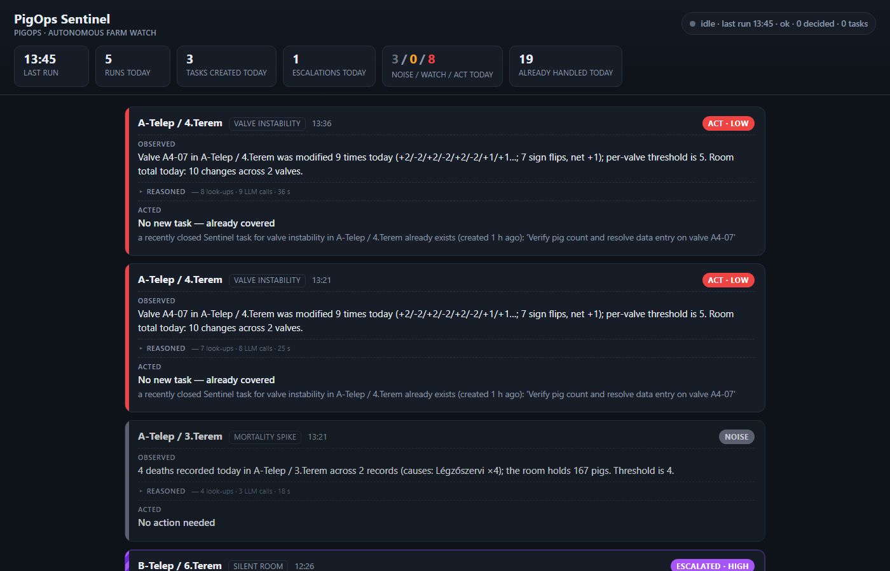
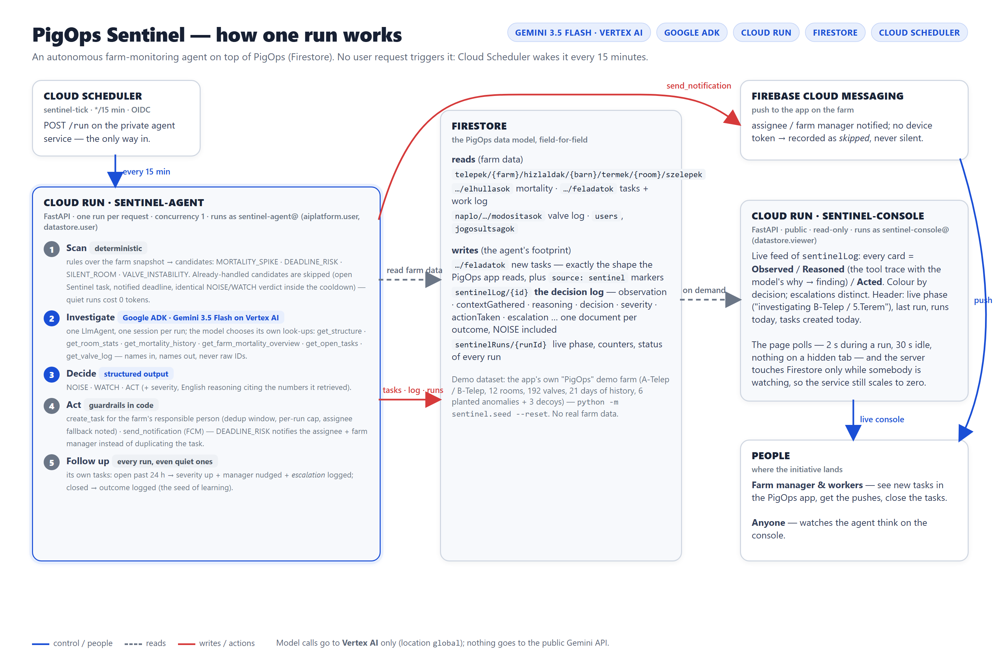

# PigOps Sentinel

**An autonomous farm-monitoring agent.** It watches a live pig farm on its own schedule, decides what matters, creates tasks for the right person, notifies them, and escalates when it is ignored — and it writes down *why* it did every one of those things, including the times it decided that a room is fine.

Built for the **All Things Agentic Hackathon** (Google / Devpost), track **The Taskmaster**, on top of PigOps — a Flutter/Firebase farm-management platform in production on Hungarian pig farms. The platform never had initiative; the Sentinel adds it.

| Hackathon requirement | What this uses |
|---|---|
| Gemini 3.5 or newer | **Gemini 3.5 Flash** on **Vertex AI** (location `global`) — every model call; nothing goes to the public Gemini API |
| Google agent framework | **Google ADK** 2.x — one `LlmAgent` with six read tools, structured output |
| Google Cloud service | **Cloud Run** (two services), **Firestore**, **Cloud Scheduler**, Firebase Cloud Messaging |

**Live console:** https://sentinel-console-5b6y6vof6a-ew.a.run.app · **Spec:** [`SPEC.md`](SPEC.md) · **Diagram:** [`docs/architecture.png`](docs/architecture.png)



---

## What it does — one run, five phases



Cloud Scheduler wakes the agent every 15 minutes. Each run:

1. **Scan** *(deterministic, no LLM)* — rules over a snapshot of the farm find *candidates*: `MORTALITY_SPIKE` (≥ 4 deaths in a room today), `DEADLINE_RISK` (task overdue, or due within 24 h and untouched), `SILENT_ROOM` (a populated room with no data for 36 h), `VALVE_INSTABILITY` (a valve flipped back and forth ≥ 5× today). Most runs find nothing and cost nothing.
2. **Investigate** *(ADK + Gemini)* — for each candidate the agent gathers context the way a farm manager would, choosing its own look-ups: `get_structure`, `get_room_stats`, `get_mortality_history`, `get_farm_mortality_overview`, `get_open_tasks`, `get_valve_log`. Tools take and return **names** ("B-Telep / 5.Terem", "Fenyvesi Márton") — raw IDs never reach the model or a human.
3. **Decide** *(structured output)* — exactly one of **NOISE** (normal, logged only), **WATCH** (worth monitoring, no task), **ACT** (a person is needed today: severity + a concrete task title/body), with an English justification that cites the numbers it actually retrieved.
4. **Act** *(guardrails in code, not in the prompt)* — `create_task` for the farm's responsible person (dedup window, per-run cap, assignee fallback noted in the log), `send_notification` via FCM. For a `DEADLINE_RISK` the task already exists, so the assignee **and** the farm manager are notified instead of a duplicate being created.
5. **Follow up** *(every run, even quiet ones)* — the Sentinel re-checks its **own** tasks: still open past 24 h → severity up, manager nudged, an `escalation` logged; closed → the outcome logged (how long it stayed open, what happened in the room meanwhile — the seed of learning).

Every phase-2..5 outcome is one document in **`sentinelLog`** — the product. The **console** renders it live: each card is *Observed / Reasoned / Acted*, colour-coded by decision, escalations visually distinct, with the model's tool trace ("why I looked → what I found") one click away.

### What "autonomous" means here — and what keeps it safe

- **Idempotent runs.** A candidate the Sentinel already dealt with is *handled*, not re-investigated: an open Sentinel task for the same room+signal, a recently closed one inside the 48 h dedup window, a deadline it already notified about, or a NOISE/WATCH verdict on **identical evidence** inside a 6 h cooldown. New evidence (one more death, another day of silence) changes the observation text and it is judged again. Overlapping runs refuse to start.
- **Guardrails are code.** Dedup window, cap of 5 new tasks per run, assignee resolution with an explained fallback, severity ladder for escalation, notification stamps so nobody is nagged every quarter hour.
- **Fail loudly.** A failed investigation is a `failed` log entry with the model's raw output; a broken run is a `run_failed` entry plus a `failed` run document — never a silent exit. Claims the model makes about look-ups it did not perform are kept in the log, flagged `verified: false`.
- **Vertex only.** The process refuses to start if a Gemini API key is present in the environment. The seed refuses to write into a project whose id does not look like a sandbox.
- **No real farm data.** The demo farm mirrors the app's own "PigOps" demo farm; the people are fictional; nothing here resembles a real PigOps site.

---

## Quick start (local, ~10 minutes)

Prerequisites: Python 3.13, the [`gcloud` CLI](https://cloud.google.com/sdk/docs/install), a Google Cloud billing account.

```bash
git clone https://github.com/arpika1996/pigops-sentinel.git
cd pigops-sentinel
python -m venv .venv && . .venv/bin/activate      # Windows: .venv\Scripts\activate
pip install -r requirements.txt
cp .env.example .env                              # defaults are fine for the demo project
```

**1. Google Cloud.** One dedicated project keeps the spend isolated and lets you tear everything down in one move.

```bash
gcloud auth login
gcloud auth application-default login             # local ADC — no key files, ever
PROJECT_ID=pigops-sentinel BILLING_ACCOUNT=XXXXXX-XXXXXX-XXXXXX ./infra/setup_gcp.sh
```

`setup_gcp.sh` is idempotent: project, billing link, APIs, Firestore (native, `europe-west1`), the two service accounts with least-privilege roles, a 10 USD budget with alerts, and the Firestore indexes (`firestore.indexes.json`, including the collection-group field override the valve log needs). Use your own `PROJECT_ID`; the id must contain `sentinel`, `demo`, `sandbox`, `test` or `dev` for the seed's safety check to pass (or pass `--allow-any-project`).

**2. Seed the demo farm** — 1 355 documents, 21 days of history, six planted anomalies and three decoys:

```bash
python -m sentinel.seed --reset          # --reset-log also clears sentinelLog / sentinelRuns
python -m sentinel.scanner               # Phase 1 only: prints the 6 candidates
```

**3. Run the agent once, locally** (Gemini on Vertex AI, ~2–3 minutes for a full farm):

```bash
python -m sentinel.agent                 # investigate + decide, print, write NOTHING (dev tool)
python -m sentinel.run                   # the real thing: scan → investigate → decide → act → follow up → log
```

**4. Watch it:** `python -m sentinel.console` → http://localhost:8081 (live, read-only). Run `python -m sentinel.run` in another terminal and watch the header switch to "investigating …" and the cards arrive.

**5. Tests** (no LLM, no Firestore — the seed plan is pure and the repository is faked): `python -m pytest` → 102 tests.

## Deploy (Cloud Run + Cloud Scheduler, ~5 minutes)

```bash
./infra/deploy.sh
```

Builds one image with Cloud Build (`Dockerfile`, `python:3.13-slim`) and deploys it twice:

| Service | Access | Runs as | Notes |
|---|---|---|---|
| `sentinel-agent` | **private** — `POST /run` with an OIDC token | `sentinel-agent@` (aiplatform.user, datastore.user) | one run per request, concurrency 1, one instance, 900 s timeout |
| `sentinel-console` | public URL | `sentinel-console@` (datastore.viewer) | FastAPI, read-only; the page polls (30 s idle, 2 s during a run, nothing while the tab is hidden), max 1 instance, concurrency 80 |

The console is public, so its cost shape is part of its design. It holds nothing open: an
SSE stream is an open Cloud Run request, and an open request keeps an instance alive and
billable — one forgotten tab used to cost an instance-hour. The page asks instead, and the
feed refreshes from Firestore only when its own cache went stale (2 s while a run is in
progress, 15 s otherwise), under a lock — so ten visitors cost one read, and nobody
looking costs nothing at all. `--max-instances 1 --min-instances 0` puts a hard ceiling on
the burn rate whatever the traffic. `/events` still serves SSE for anyone who wants a
stream; the page does not use it.

…then creates `sentinel-scheduler@` (run.invoker on the agent) and the Cloud Scheduler job **`sentinel-tick`** (`*/15 * * * *`, Europe/Budapest, OIDC, no retries). No secrets anywhere: Application Default Credentials *are* the service accounts.

```bash
gcloud scheduler jobs run   sentinel-tick --location europe-west1   # a run right now
gcloud scheduler jobs pause sentinel-tick --location europe-west1   # stop the cadence
SKIP_BUILD=1 ./infra/deploy.sh                                       # config/IAM changes without a rebuild
```

## Configuration

Everything tunable is an environment variable (see [`.env.example`](.env.example)); nothing else in the code reads `os.environ`.

| Variable | Default | Meaning |
|---|---|---|
| `GOOGLE_CLOUD_PROJECT` / `GCP_REGION` | `pigops-sentinel` / `europe-west1` | project; region of Cloud Run, Firestore, Scheduler |
| `GOOGLE_CLOUD_LOCATION` | `global` | Vertex AI location for Gemini 3.5 (not served from europe-west1) |
| `GOOGLE_GENAI_USE_ENTERPRISE`, `GOOGLE_GENAI_USE_VERTEXAI` | `TRUE` | route every model call through Vertex AI (both spellings the SDK lineage has used) |
| `GEMINI_MODEL` | `gemini-3.5-flash` | |
| `DEMO_FARM_ID` | `demo-farm` | the farm document the agent watches |
| `SCAN_INTERVAL_MINUTES` | `15` | cadence; also the overlap guard's window (×2) |
| `MORTALITY_SPIKE_THRESHOLD` / `MORTALITY_BASELINE_DAYS` | `4` / `14` | absolute daily trigger; the baseline is context for the reasoning, not a trigger |
| `VALVE_CHANGE_THRESHOLD` / `VALVE_FLAP_THRESHOLD` | `25` / `5` | room-level / per-valve daily modification counts |
| `SILENT_ROOM_HOURS` / `DEADLINE_SOON_HOURS` | `36` / `24` | |
| `MAX_TASKS_PER_RUN` / `DEDUP_WINDOW_HOURS` / `ESCALATION_HOURS` | `5` / `48` / `24` | Phase 4/5 guardrails |
| `DECISION_COOLDOWN_HOURS` | `6` | a NOISE/WATCH verdict on identical evidence is not re-litigated inside this window (0 = off) |
| `TASK_LANGUAGE` | `en` | language of the task text written for farm workers (`hu` for a real Hungarian farm); reasoning and the log are always English |

## The decision log — `sentinelLog`

One document per outcome (SPEC §5), the console's only data source:

```
runId · timestamp · farmName · roomName · signalType · observation
contextGathered[]   the tool trace as it actually ran, with the model's why → finding merged on
reasoning · decision (NOISE | WATCH | ACT) · severity (low | medium | high)
actionTaken         { type, status, tool, taskId, taskTitle, assigneeName, assigneeNote, deadline, sentAt, notifications[], reason }
escalation          { fromSeverity, toSeverity, reason }
latencyMs · status (decided | failed | run_failed | escalated | closed) · tokens · llmCalls · proposedAction · watchReason · outcome
```

`sentinelRuns/{runId}` holds every run's live phase (`scanning → investigating "SIGNAL — room" → acting → following_up → done`), counters and status (`ok | partial | failed | skipped`).

## The demo farm

`python -m sentinel.seed` builds **PigOps** — the app's own demo farm: barns **A-Telep / B-Telep**, six rooms each (`1.Terem … 6.Terem`), 16 valves per room (`A5-04` = valve 4 of A-Telep / 5.Terem), three fictional people (Fenyvesi Márton — farm admin; Halászi Réka and Csontos Bertalan — workers), 21 days of mortality and valve-log history, and — always relative to *now* — six planted anomalies:

| Planted | Where | What the agent should do |
|---|---|---|
| Mortality spike — 5 respiratory deaths, 14-day mean 0.7 | B-Telep / 5.Terem | **ACT / high**, task for the farm manager |
| Chronic room — 4 deaths, but ≈2.5/day for 10 days *and* an open treatment task with daily work-log entries | A-Telep / 3.Terem | **NOISE** (judgement, not a rule) |
| Silent room — 189 pigs, no data for 3 days, neighbours active | B-Telep / 6.Terem | **ACT**, task |
| Flapping valve A4-07 — +2/−2 eight times, net ~0 | A-Telep / 4.Terem | **ACT / low**, "verify the count" |
| Fan repair 2 days overdue, never touched | A-Telep / 2.Terem | **ACT**, notify assignee + manager |
| Drinker check due in 6 h, never touched | B-Telep / 3.Terem | **ACT / medium**, notify |

…and three decoys that must **not** become candidates: 3 deaths in a room (below the threshold), an empty room silent for 12 days (empty rooms are silent between batches), and a task due in 10 h that already has work-log entries.

## Repository layout

```
sentinel/
  config.py        every tunable, env-overridable; Vertex-only guard
  schema.py        the PigOps Firestore data model, field-for-field (Hungarian field names)
  repository.py    typed reads + the writes the Sentinel makes (tasks, sentinelLog, sentinelRuns)
  seed/            the demo farm (pure builder + `python -m sentinel.seed`)
  scanner.py       Phase 1 rules + the "already handled" guard
  agent/           Phase 2–3: ADK LlmAgent, tools, prompt, Decision schema, `python -m sentinel.agent`
  actions.py       Phase 4: create_task / send_notification with the guardrails
  followup.py      Phase 5: escalation + outcome logging
  logbook.py       sentinelLog document builders
  run.py           the orchestrator: `python -m sentinel.run`
  service.py       the sentinel-agent Cloud Run service (POST /run)
  console/         the sentinel-console Cloud Run service (FastAPI, cached reads, one HTML page)
tests/             107 tests; no LLM, no Firestore
infra/             setup_gcp.sh (project bootstrap), deploy.sh (Cloud Run + Scheduler)
docs/              architecture diagram (html source + png), console screenshot, demo script
```

## Cost

Gemini 3.5 Flash on Vertex AI: a full six-candidate investigation is roughly 150–200k tokens (≈ 2–3 minutes); a quiet run — which is most of them — is zero tokens because handled candidates never reach the model. Cloud Run scales to zero between ticks; the console polls Firestore with queries that cost one read when nothing changed. The whole demo runs comfortably inside a 10 USD budget for the hackathon period.

## Status

All ten steps of the build order in `SPEC.md` are done except the video: the agent has been running on the 15-minute cadence in the cloud since 2026-08-15, and the console above is live.
